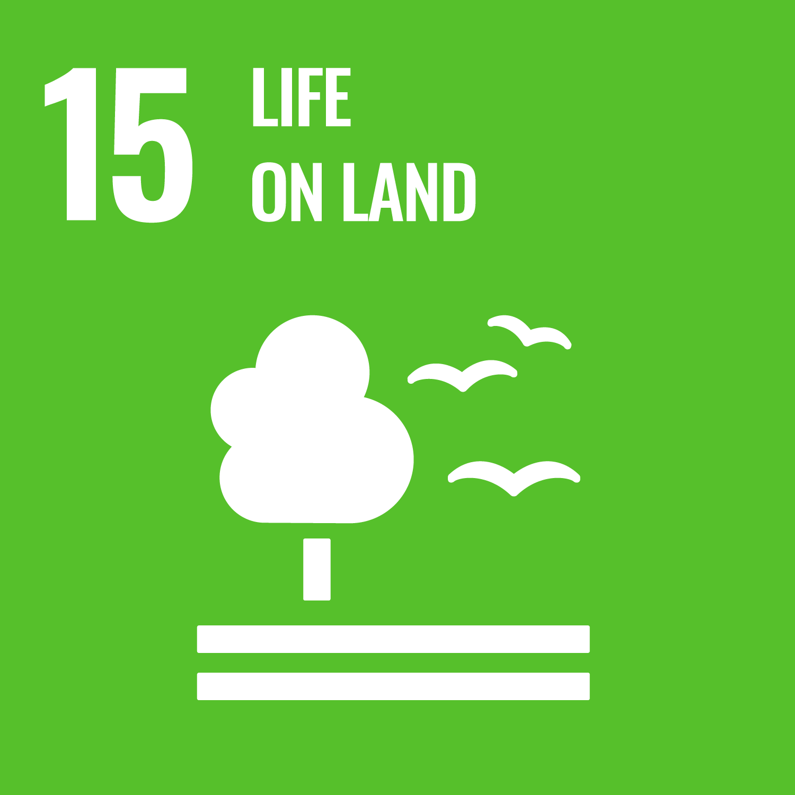

# Land Use Optimization

<!-- Describe the project in one sentence, e.g. A project that... -->
Allocation of land for different uses significantly affects carbon balance and climate change. A surrogate model can be learned from historical land-use changes and carbon emission simulations allows efficient evaluation of such allocations. An evolutionary search can then discover effective land-use policies for specific locations, trading off carbon impact and amount of change, offering a useful tool for land-use planning.

<!-- Inser SDG Icons and links-->
|  |  |
|--------------------------------------------------------------------|------------------------------------------------------------------|

## Decision makers

<!-- List decision makers that could use this project-->
- Private land owners
- Governments

## Objectives

<!-- Describe the objectives of the project in one sentence -->
To optimize land-use changes trading off minimizing carbon emissions and cost of land-use changes.

## Interactive application

<!-- Provide a link to the interactive application -->
The user interface is available here: [Land Use Demo](https://landuse.evolution.ml)

## Data attributes

### Context

<!-- Describe the situation decision makers are in when then have to make a decision -->
The situation decision makers are in when they have to make a decision can be described by the following attributes:

- Current land use percentages
    - Crops
    - Fields
        - Pasture
        - Range (unmanaged, such as savannah, grassland, etc.)
    - Primary vegatation (note: after human intervention it is impossible for vegatation to become primary again)
        - Forest
        - Non-forest
    
    - Secondary vegatation
        - Forest
        - Non-forest
    - Urban
- Year
- Latitude, longitude
- Cell area

### Actions

<!-- Describe what the decision makers can do achieve their objectives -->
Decision makers change the land use percentages in the following categories. Primary vegatation is prevented from being changed because the ultimate goal should be to preserve it. Urban land is unable to be changed because different sets of decision-makers are responsible for urban planning.:
- Crop diff
- Field diff
    - Pasture diff
    - Range diff
- Secondary vegatation diff
    - Forest diff
    - Non-forest diff

### Outcomes

<!-- Describe the metrics decision makers are trying to optimize, on which they are evaluatded -->
Decision makers are evaluated on the following outcomes:
- Emissions from Land Use Change (ELUC) in tonnes of carbon per hectare
- Change in land use percentages

## Data

<!-- Describe the data that is used to evaluate the decisions -->
The dataset of historical context/action/outcomes decisions is available here: [HuggingFace](https://huggingface.co/datasets/projectresilience/ELUC-committed)

## Code

<!-- Point to the repo that contains the code -->
The code for this project is available here: [Github](https://github.com/Project-Resilience/mvp)

## References

<!-- Provide a list of references or other resources used in the project -->
- ELUC data provided by the BLUE model [(BLUE: Bookkeeping of land use emissions)](https://doi.org/10.1002/2014GB004997)

- Land use change data provided by the LUH2 project [(LUH2: Land Use Harmonization 2)](https://luh.umd.edu/)

- Setup is described in Appendix C2.1 of the GCB 2022 report [(Global Carbon Budget 2022 report)](https://doi.org/10.5194/essd-14-4811-2022)

- The Global Carbon Budget report assesses the global CO2 budget for the Intergovernmental Panel on Climate Change [(IPCC)](https://www.ipcc.ch/)

- A paper was written on this project and presented at: United Nations AI for Good Global Summit 2023, [NeurIPS 2023 Workshop: Tackling Climate Change with Machine Learning](https://www.climatechange.ai/papers/neurips2023/94) (spotlight presentation + best pathway to impact award), and [BayLearn 2024](https://baylearn-org.github.io/www/submissions.html#:~:text=Utilizing%20Surrogate%20Modeling%20and%20Evolutionary%20Policy%20Search%20to%20Discover%20Effective%20Policies%20for%20Land%2DUse%20Planning). The full paper can be found here: [(Paper)](https://nn.cs.utexas.edu/?miikkulainen:arxiv23)

## Discussion

<!-- Provide a link to a space for discussion or comments -->
(no discussion yet)

[Back to the list of projects](../README.md)