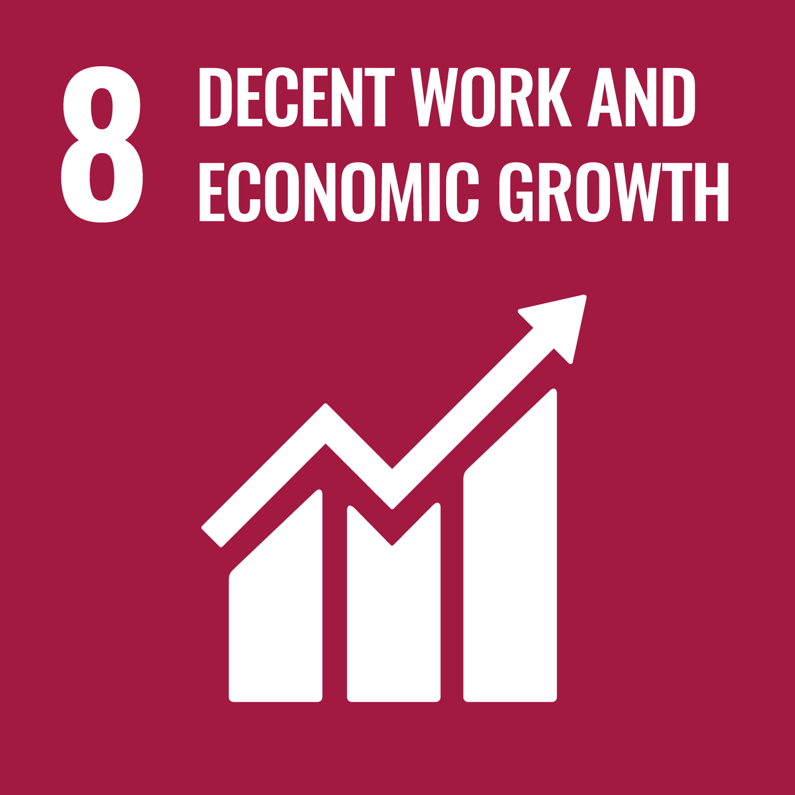

# Decent Work Initiatives

<!-- Describe the project in one sentence, e.g. A project that... -->
A project to help understanding the effectiveness of initiatives aimed at creating decent work conditions,
analyzing data on employment quality, worker satisfaction, and economic impact.

<!-- Note: using reference-style links to let Jekyll's relative links
convert them to .html in GitHub pages -->
[goal_08_link]: ../goals/goal_08.md

<!-- Insert SDG Icons and links-->
| [][goal_08_link] |  |  |
|--------------------------------------------------------------|-------------------------------|-------------------------------|

## Decision makers

<!-- List decision makers that could use this project-->
- Government Agencies
- NGOs
- Private Sector

## Objectives

<!-- Describe the objectives of the project in one sentence -->
To improve the quality of employment across various sectors.

## Interactive application

<!-- Provide a link to the interactive application -->
(none)

## Data attributes

### Context

<!-- Describe the situation decision makers are in when then have to make a decision -->
The situation decision makers are in when they have to make a decision can be described by the following attributes:

1. **Sector** (Categorical): ['Agriculture', 'Manufacturing', 'Services', 'Technology', 'Construction']
2. **Region** (Categorical): ['NorthAmerica', 'Europe', 'Asia', 'Africa', 'SouthAmerica']
3. **EconomicStatus** (Categorical): ['Developed', 'Developing', 'Underdeveloped']
4. **UnemploymentRate** (Numerical, Integer): Represented as a percentage.
5. **ExistingLaborLaws** (Categorical): ['Strong', 'Moderate', 'Weak']
6. **PrevWorkerSatisfaction** (Numerical, Integer): Scale from 1 to 10.
7. **PrevEmploymentQuality** (Numerical, Integer): Scale from 1 to 10.
8. **AverageWage** (Numerical, Integer): Average monthly wage in USD.
9. **EmploymentRateChange** (Numerical, Integer): Change in employment rate over the past year, percentage.
10. **PrevEconomicImpact** (Numerical, Integer): Scale from 1 to 10, assessing the economic impact of previous initiatives.

### Actions

<!-- Describe what the decision makers can do achieve their objectives -->
Decision makers can take the following actions:

1. **InitiativeType** (Categorical): ['TrainingProgram', 'WageSubsidy', 'EmploymentProtection', 'JobCreation', 'WorkConditionImprovement']
2. **InvestmentAmount** (Numerical, Integer): Amount in USD (thousands).
3. **TargetGroup** (Categorical): ['Youth', 'Women', 'UnskilledWorkers', 'MigrantWorkers', 'All']
4. **Duration** (Numerical, Integer): Duration of the initiative in months.
5. **Partnership** (Categorical): ['None', 'LocalNGOs', 'InternationalNGOs', 'Government', 'PrivateSector']

### Outcomes

<!-- Describe the metrics decision makers are trying to optimize, on which they are evaluated -->
Decision makers are evaluated on the following outcomes:

1. **WorkerSatisfaction** (Numerical, Integer): Scale from 1 to 10. (Maximize)
2. **EmploymentQuality** (Numerical, Integer): Scale from 1 to 10. (Maximize)
3. **EconomicImpact** (Numerical, Integer): Scale from 1 to 10. (Maximize)
4. **Cost** (Numerical, Integer): Calculated based on InvestmentAmount, Duration, and the effectiveness of the initiative. (Minimize)
## Data

<!-- Describe the data that is used to evaluate the decisions -->
(none)

## Code

<!-- Point to the repo that contains the code -->
(none)

## References

<!-- Provide a list of references or other resources used in the project -->
(none)

## Discussion

<!-- Provide a link to a space for discussion or comments -->
(no discussion yet)

[Back to the list of projects](../README.md)