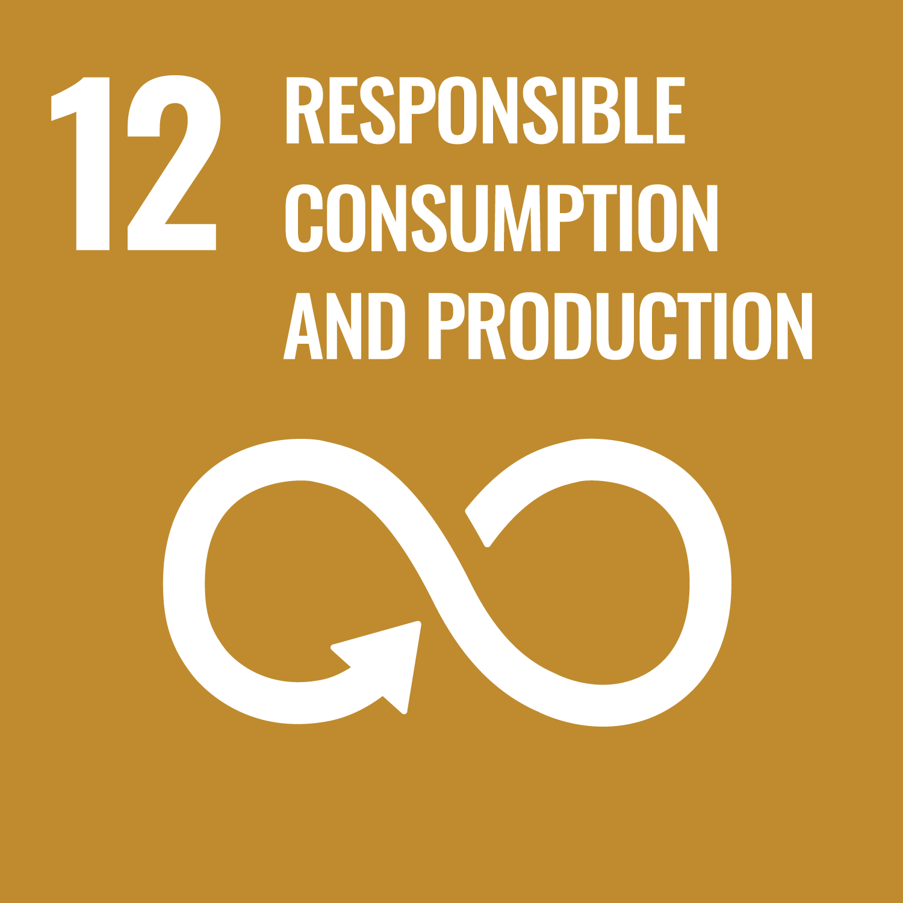

# Plastic Pollution Reduction

<!-- Describe the project in one sentence, e.g. A project that... -->
For a focused scope on Marine Pollution Reduction Strategies, we'll concentrate on a single pollution type:
Plastic Pollution. This choice is due to the widespread recognition of plastic waste as a significant and growing threat
to marine environments worldwide.

<!-- Note: using reference-style links to let Jekyll's relative links
convert them to .html in GitHub pages -->
[goal_14_link]: ../goals/goal_14.md
[goal_12_link]: ../goals/goal_12.md

<!-- Insert SDG Icons and links-->
| [][goal_14_link] | [][goal_12_link] |  |
|--------------------------------------------------------------|--------------------------------------------------------------|-------------------------------|

## Decision makers

<!-- List decision makers that could use this project-->
- Environmental Protection Agencies
- Policy Makers

## Objectives

<!-- Describe the objectives of the project in one sentence -->
To reduce plastic pollution in marine environments through the implementation of effective policies and strategies.

## Interactive application

<!-- Provide a link to the interactive application -->
(none)

## Data attributes

### Context

<!-- Describe the situation decision makers are in when then have to make a decision -->
The situation decision makers are in when they have to make a decision can be described by the following attributes:

1. **AffectedAreaSize** (Numerical, square kilometers): Continuous value.
2. **BiodiversityImpactLevel** (Categorical): [Low, Medium, High]
3. **EconomicImpactLevel** (Categorical): [Low, Medium, High]
4. **Region** (Categorical): [NorthAmerica, SouthAmerica, Europe, Africa, Asia, Oceania, Antarctica]
5. **PrevActionEfficiency** (Categorical): [None, Low, Medium, High]
6. **CommunityEngagementLevel** (Categorical): [Low, Medium, High]
7. **LegislationExistence** (Categorical): [Yes, No]
8. **AnnualTourismRevenue** (Numerical, millions USD): Continuous value.
9. **LocalEconomyDependency** (Categorical): [Low, Medium, High]
10. **Season** (Categorical): [Dry, Wet] - Season during which the data is collected, affecting plastic runoff.

### Actions

<!-- Describe what the decision makers can do achieve their objectives -->
Decision makers can take the following actions:

1. **ActionType** (Categorical): [BanSingleUsePlastics, WasteManagementInfrastructure, CleanupInitiatives, PublicAwarenessCampaigns, InternationalAgreements]
2. **InvestmentAmount** (Numerical, millions USD): Continuous value.
3. **ImplementationPeriod** (Numerical, months): Integer value.
4. **StakeholderInvolvement** (Categorical): [LocalCommunities, Businesses, NGOs, Government]
5. **TechnologyUse** (Categorical): [None, Low, Medium, High]

### Outcomes

<!-- Describe the metrics decision makers are trying to optimize, on which they are evaluated -->
Decision makers are evaluated on the following outcomes:

1. **PollutionReduction** (Categorical): [None, Low, Medium, High] (Maximize)
2. **EconomicImpact** (Categorical): [Negative, Neutral, Positive] (Maximize)
3. **BiodiversityRecovery** (Categorical): [None, Low, Medium, High] (Maximize)
4. **Cost** (Numerical, millions USD): Continuous value - Calculated based on InvestmentAmount, ImplementationPeriod, and any indirect costs or savings. (Minimize)

## Data

<!-- Describe the data that is used to evaluate the decisions -->
(none)

## Code

<!-- Point to the repo that contains the code -->
(none)

## References

<!-- Provide a list of references or other resources used in the project -->
(none)

## Discussion

<!-- Provide a link to a space for discussion or comments -->
(no discussion yet)

[Back to the list of projects](../README.md)